# Linux Assignment 3 Part 2

  
This assignment will help you to set up two droplet servers with a load balancer.

Then it will help you to configure each server setting up with the same steps in Linux Assignment 3 Part 1, by running automated scripts.

To know more about what the scripts do, visit [linux-assignment3-part1](https://github.com/nuree-cit/linux-assignment3-part1). This scripts will do the tasks in the `README.md` for you.

Before you start, you must have:
- Digital Ocean account
- ssh key setting within `config` file

### **Please follow each process in order.**

## 1. Get the newest Arch Linux image

1-1. Go to the Arch Linux download page [Arch Linux - Downloads](https://archlinux.org/download/)

1-2. In the 'VM images' sector, click **git lab instance**

1-3. Click the newest version of **images**

1-4. Scroll down and find the file that contains **'cloudimg'** and **'.qcow2'** in the name.

1-5. Download it into your local device.

> [!TIP]
> **cloudimg** means that this file is optimized for the usage of cloud environment. 
> **.qcow2** is one of the formats that is used for virtual disk.

## 2. Create a new project

2-1. Go to [DigitalOcean](https://cloud.digitalocean.com/) and log in.
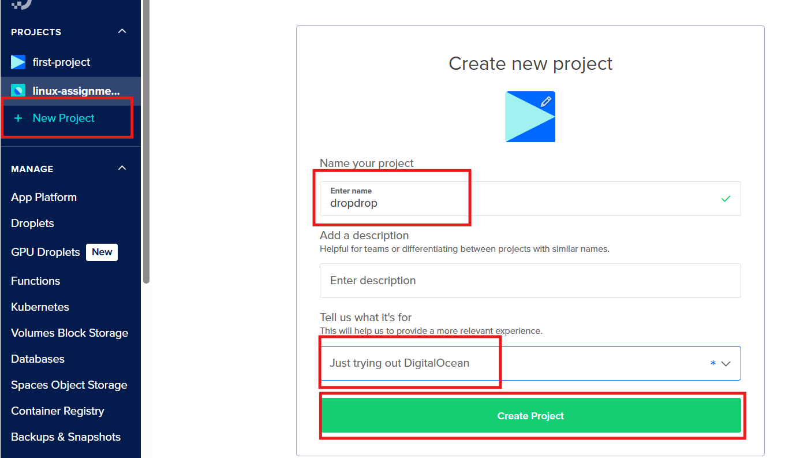

2-2. Click the **New Project** in the left side menu.

2-3. Make a name

2-4. Click the drop down menu and choose a purpose
- It doesn't really matter what purpose you choose.

2-5. Click green button **Create Project**
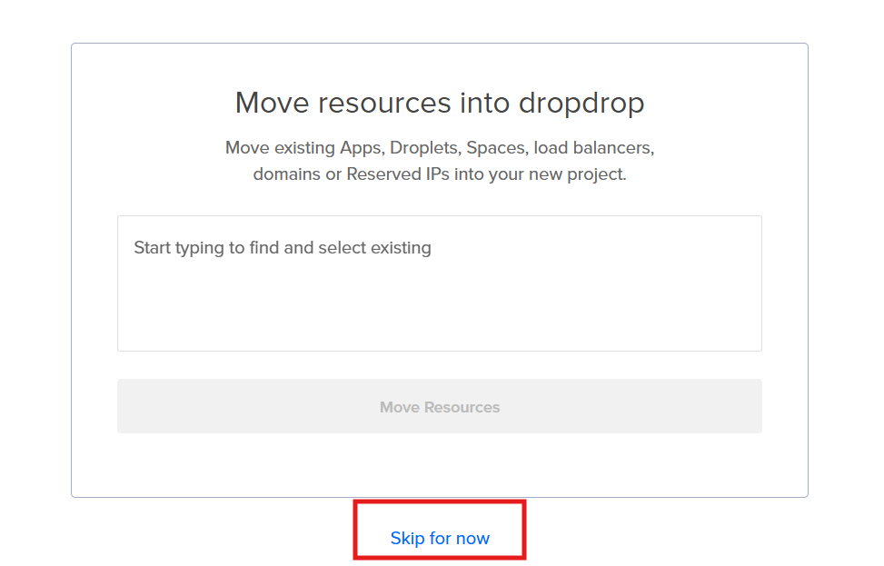

2-6. Click **Skip for now**

#### You will use this project to set up your droplet servers and a load balancer.

## 3. Create droplets
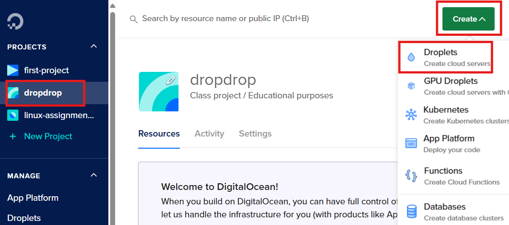

3-1. Click the **project name** you just created in [Step 2](#2-create-a-new-project) on the left side menu.

3-2. Click the green button **Create**

3-3. Click **Droplets**
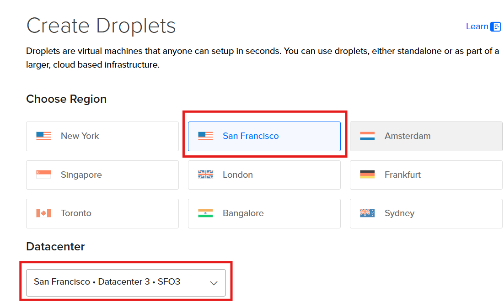

3-4. Choose Region **San Francisco**

3-5. Choose Datacenter **San Francisco Datacenter 3 SFO3**

> [!TIP]
> We choose **'SFO3'** because that is the closest data center to the end user, which is us.
> 
3-6. Click **Custom images**, and click **Add image**
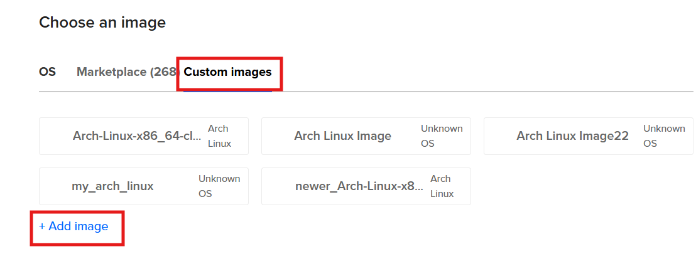

3-7. Click **Upload Image** and upload the newest Arch Linux image that you have downloaded in the [Step 1](#1-get-the-newest-arch-linux-image).
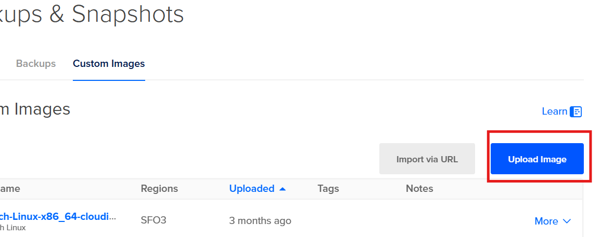

3-8. Choose the image you just uploaded
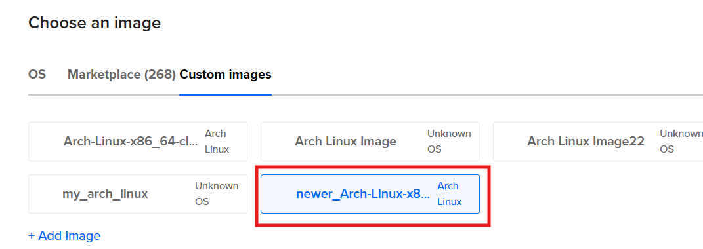

3-9. Choose CPU option you want
> [!TIP]
> The cheapest option is the left most one under the basic plan.

3-10. Choose **SSH Key** for the authentication method and connect keys you want to use.
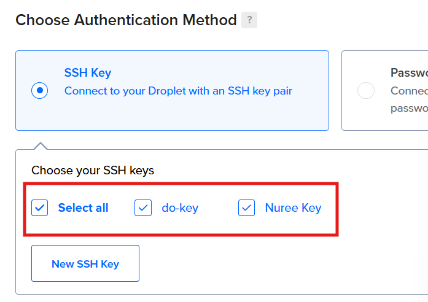
> [!TIP]
> Keep in mind which key you choose for the following [Step 5-2](#5-configure-ssh)

3-11.  Make **2 Droplets**
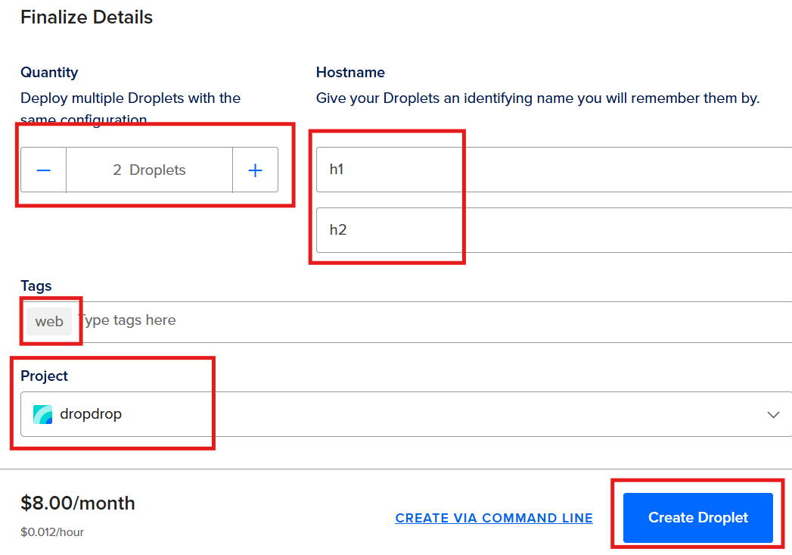

3-12.  Give them **Hostname**

3-13.  Give them a tag **'web'**

> [!IMPORTANT]
> The tag **'web'** will be used for the load balancer to find which droplets to connect.

3-14. Add to project you just created.

3-15. Click the blue button **Create Droplet**

#### Now you have created your droplet servers.

## 4. Create a load balancer
A load balancer stays between servers and the internet, distributing network traffic across multiple servers to ensure no single server becomes overwhelmed.

4-1. Click the green button **Create**
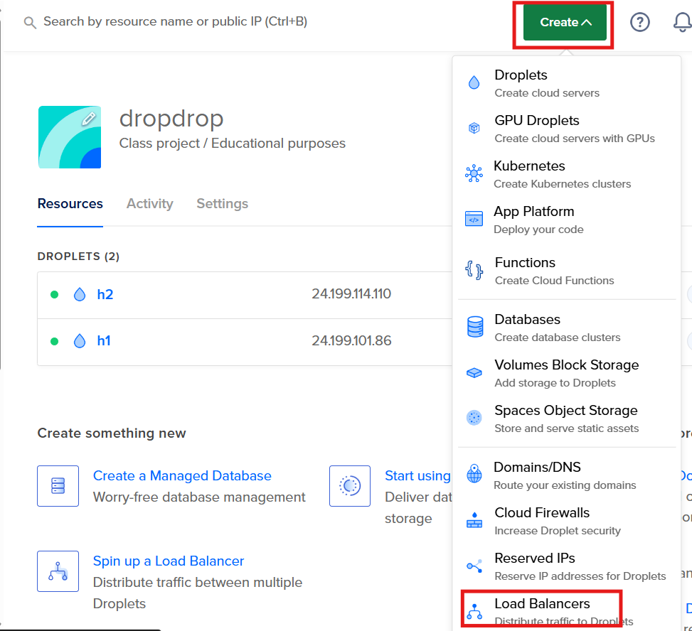

4-2. Click **Load balancer**

4-3. Choose a type as **Regional**
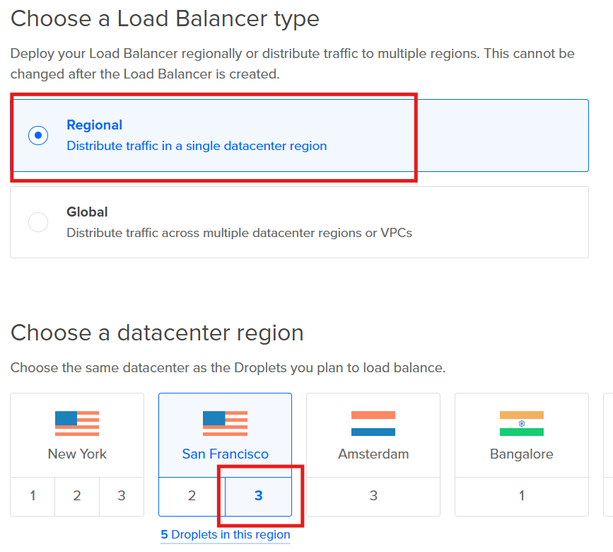

4-4. Choose a datacenter in **San Francisco 3**

4-5. Choose default VPC

4-6. Choose Network Visibility **External(Public)**

4-7. Connect droplets by giving a tag **'web'**
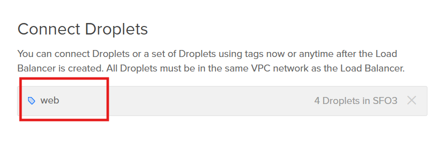

4-8. Choose a name for load balancer
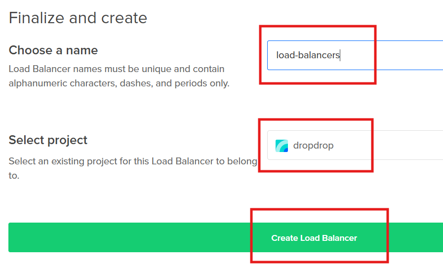

4-9. Select the project

4-10. Click **Create Load Balancer**

  #### Now you finished setting up the load balancer.

## 5. Configure `ssh`

5-1. Open the config file `C:/Users/username/.ssh/config`

> [!NOTE]
> The file path for `config` may differ depends on where you set.

5-2. Add this code to the config file

```
Host servername1 #choose the host name you want to use for the first server
    HostName 24.199.114.110 #change it to the actual IP address of your first server from step 5-4.
    User arch #
    PreferredAuthentications publickey
    IdentityFile ~/.ssh/do-key #change it to your key from the step 3-10.
    StrictHostKeyChecking no
    UserKnownHostsFile /dev/null

Host servername2 #choose the host name you want to use for the second server
    HostName 24.199.114.110 #change it to the actual IP address of your second server from step 5-4.
    User arch
    PreferredAuthentications publickey
    IdentityFile ~/.ssh/do-key
    StrictHostKeyChecking no
    UserKnownHostsFile /dev/null
```

5-3. Choose **host name** for server 1 and server 2

5-4. Change ssh key file path.

5-5. Get IP addresses from droplets and change.
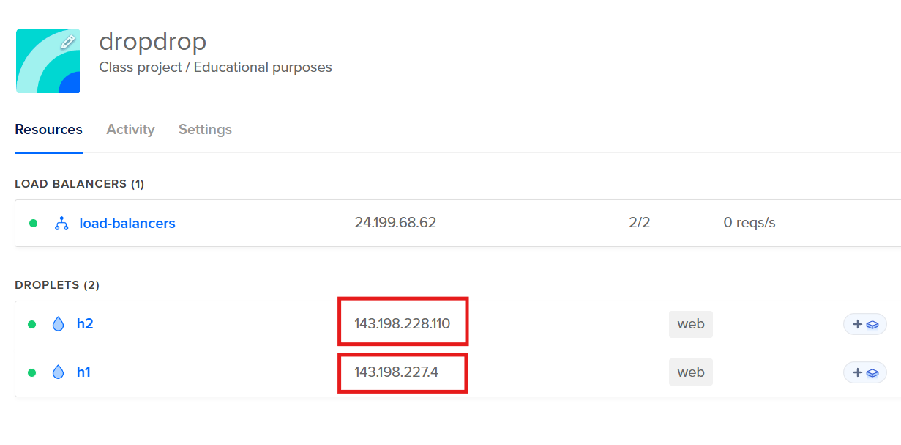
> [!IMPORTANT]
> You need the `ipv4` ip address, not a `private IP`

5-5. Save file and exit.

#### Now you are ready to connect your servers through `ssh`.

## 6. Connect to the server and clone necessary files

> [!IMPORTANT]
> From here, you will first work with your server 1 only.
> For the server 2, you will be noticed when you need it.

6-1. In windows, open `powershell`

6-2. Connect to the server through `ssh`

```shell
ssh servername
```
- Change `servername` to your actual server name from [Step 5-2](#5-configure-ssh) `config` file.

6.3. Update packages
```shell
sudo pacman -Syu --noconfirm
```

6-4. Download package `git`

```shell
sudo pacman -S --noconfirm git
```

6-5. Clone repository

```shell
git clone https://github.com/nuree-cit/linux-assignment3-part2
```
- This is the step you download the necessary code to your server.

6-6. Update file permission

```shell
sudo chmod -R u+x ./linux-assignment3-part2
```

#### Now you are ready to run automated configure scripts.

## 7. Run the scripts

> [!IMPORTANT]
> You must run those scripts with `sudo` permission.

7-1. Run the script `configScript`

```bash
sudo ./linux-assignment3-part2/configScript -1
```

An option must be provided

-1: for the server 1

-2: for the server 2

if you see:

`script finished!`

Your script finished its work successfully.

7-2. run the script `checkCheck`

```bash
sudo ./linux-assignment3-part2/checkCheck
```

- This script will display some useful information to see if configuration has successfully finished.

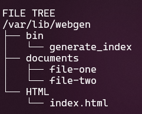

    - show file tree of `/var/lib/webgen`

    - print the test file `file-server-1` or `file-server-2` depends on which server are you at

    - show system status and log of `generate_index.service`, `generate_index.timer` and `nginx.service`


## 8. Configuring for the second server.

8-1. Repeat the tasks from the [Step 6](#6-connect-to-the-server-and-clone-necessary-files) for the server 2.

> [!IMPORTANT]
> Make sure you connect to the server 2 and run the `configScript` script with option `-2`  

## 9. Check your configuration through accessing IP addresses.
9-1. Go to the project in [DigitalOcean](https://cloud.digitalocean.com/)
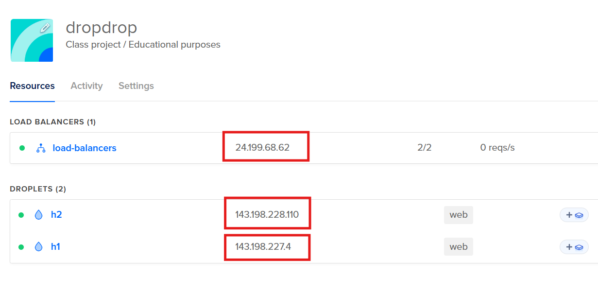

9-2. Check the IP addresses of **load balancer**, **server 1** and **server 2**

9-3. Copy and paste each of the IP address to the web browser.

**For the server 1**
http://143.198.227.4/

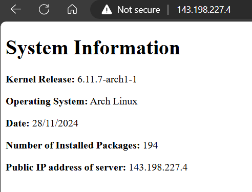

You can also check the file in the `/documents` directory through the web browser.
It will show you which server are you at.

http://143.198.227.4/documents

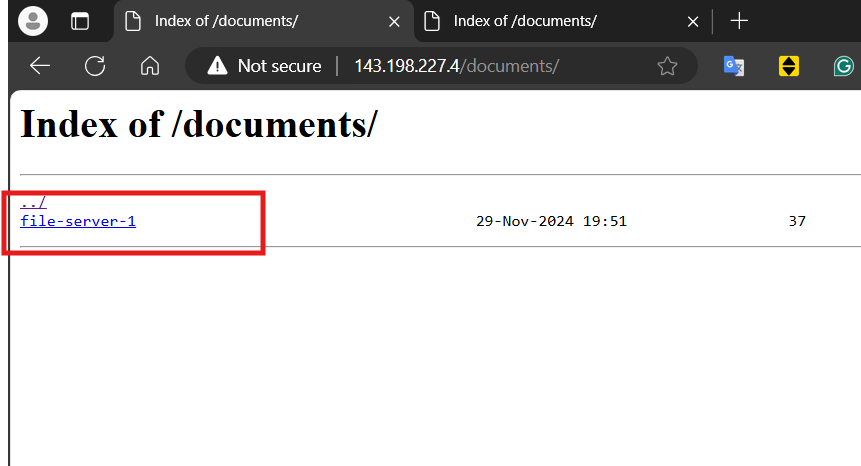

**For the server 2**
http://143.198.228.110/

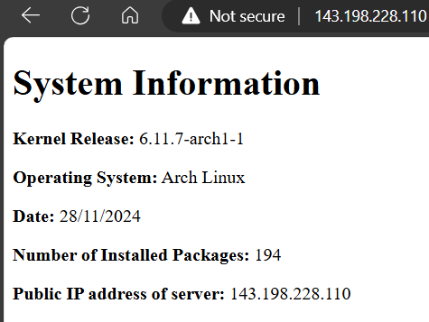

http://143.198.228.110/documents

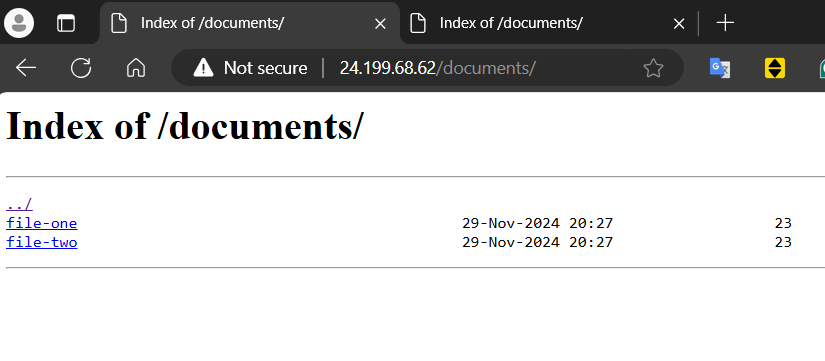

**For the load balancer**
http://24.199.68.62/

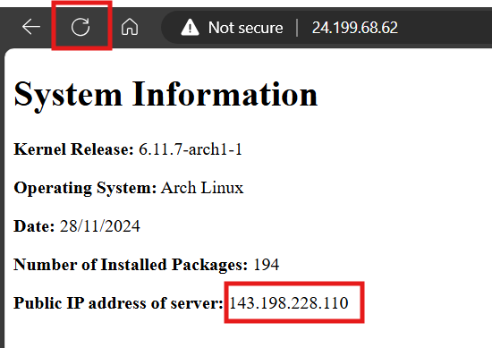

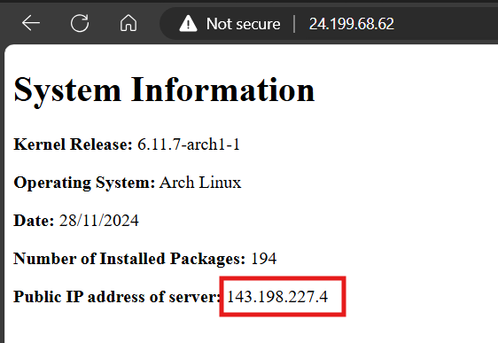

If you click a refresh button few times, you will see the public IP address of server is changed from server 1 to 2, and 2 to 1.

You can also check the file through the load balancer

http://24.199.68.62/documents 

This will also change the file by the time you clicking refresh button.

This is the evidence that the load balancer is managing and distributing incoming traffic between your server 1 and 2.


## Congratulation! you have successfully created and configured new droplet servers with the load balancer!